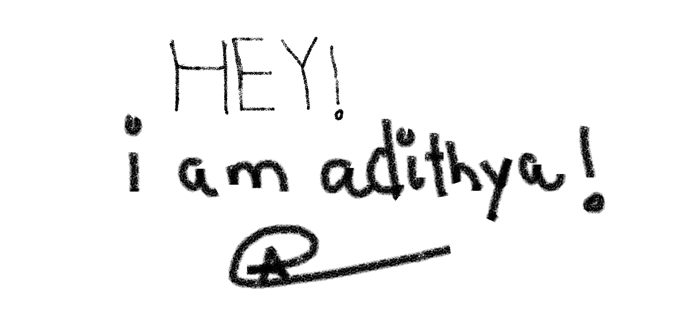

<head>
<link rel="stylesheet" type='text/css' href="https://cdn.jsdelivr.net/gh/devicons/devicon@latest/devicon.min.css" />       
</head>

<h1>So far!</h1>

<h2>&nbsp;Skills I Posses!</h2>

          

<!---
adithya1770/adithya1770 is a ✨ special ✨ repository because its `README.md` (this file) appears on your GitHub profile.
You can click the Preview link to take a look at your changes.
--->
